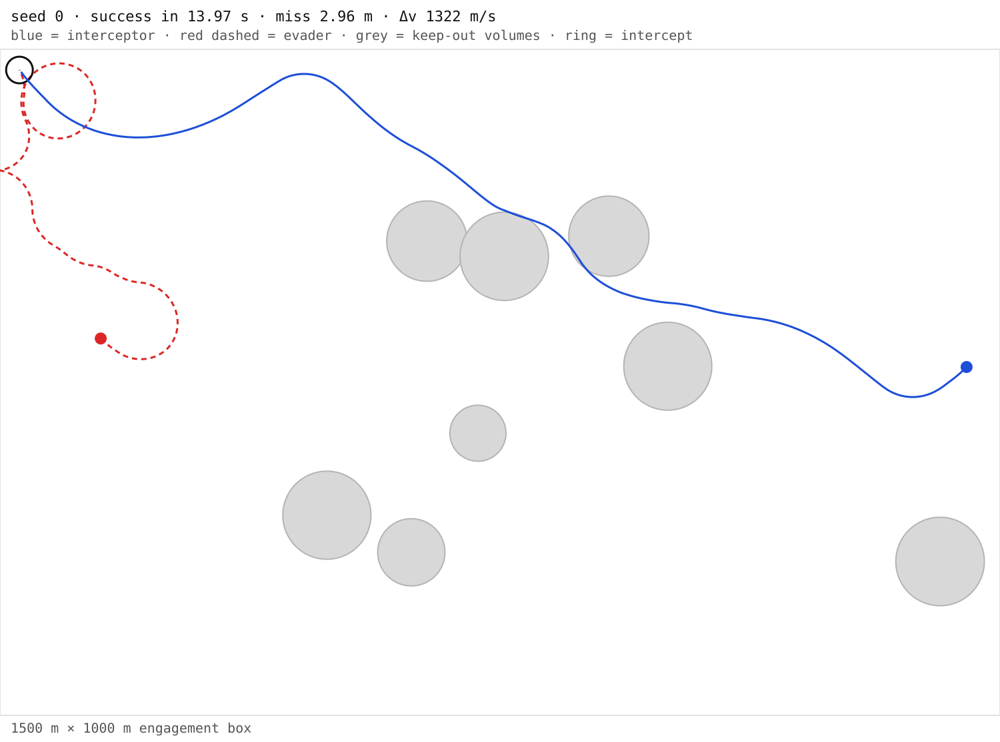
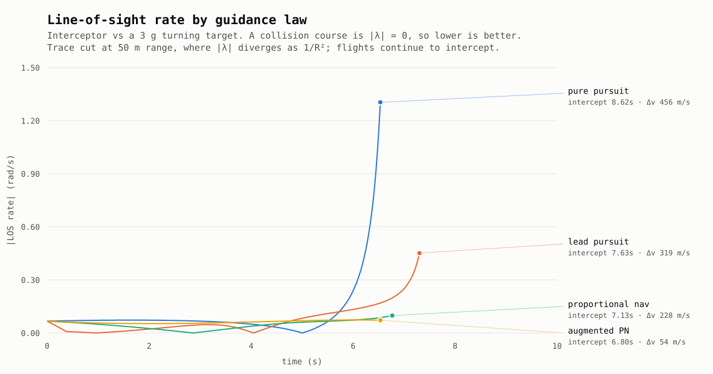

# Interception simulator

A 2D counter-UAS engagement simulator: an interceptor runs down a manoeuvring
target through a field of keep-out volumes, flying a guidance law you can swap
at runtime, and the run is scored on the metrics an engagement is actually
judged by — probability of kill, time to intercept, miss distance, and control
effort.

**[Run it in your browser →](https://owenbattles.github.io/simulated-interception/)**
The C++ engine is compiled to WebAssembly, so the simulation runs client-side.
No server, nothing to keep awake.



## Architecture

One engine, three consumers. The same C++ sources back all of them, so a
native sweep, a Python script, and the browser cannot disagree about physics.

```
core/          C++17 engine — dynamics, guidance, collision, world
  ├── native   → CMake library + CTest suite
  ├── pybind11 → interception._core: CLI, pygame view, figure scripts
  └── wasm     → the browser app, via Emscripten
```

## Scenario

A fixed-wing interceptor engages a quadrotor inside a 1500 m × 1000 m box
containing 5–10 circular no-fly volumes.

|  | Interceptor | Target |
| --- | --- | --- |
| Max speed | 120 m/s | 80 m/s |
| Max lateral acceleration | 200 m/s² (≈20 g) | 100 m/s² (≈10 g) |
| Turn radius at max speed | 72 m | 64 m |
| Mass | 5 kg | 3 kg |
| Capture radius | 2 m | 1 m |

The target turns tighter than the interceptor, which is what makes the
geometry non-trivial: raw speed advantage does not guarantee an intercept.

## Guidance

Four laws share one interface, swappable at runtime and comparable on
identical seeds.

| Law | Command | Idea |
| --- | --- | --- |
| `pursuit` | point at where the target **is** | The naive baseline. Always converts into a tail chase. |
| `lead` | point at where the target **will be**, using `t_go = range / max speed` | Exact head-on, degrades in a crossing geometry. |
| `pn` | `a = N · V_c · λ̇`, normal to the line of sight | Drives the LOS rate to zero. |
| `apn` | PN plus `N/2` of the target's LOS-normal acceleration | Recovers the lag PN shows against a manoeuvring target. |

The insight behind PN is that a collision course is *exactly* the condition
`λ̇ = 0`: if the bearing to the target is not rotating, the two are converging
on the same point. So rather than predicting where the target will be, PN just
nulls the rotation of the sight line — no prediction required. That is what
real interceptors fly.

Guidance commands turn only; whatever force budget the turn leaves over is
spent closing to top speed, with turning given priority.



Against a steady 3 g turning target the textbook ordering comes out cleanly.
Pure pursuit lets the LOS rate run away as range closes; PN holds it near zero
and intercepts 1.5 s sooner for half the control effort; APN nulls the residual
that PN leaves against an accelerating target and does it for **8× less Δv than
pursuit**.

## Results

500 seeds per law, 1 interceptor vs 1 target:

| Guidance | Success | Mean TTI | Median TTI | Mean miss | Mean Δv |
| --- | --- | --- | --- | --- | --- |
| `pursuit` | 100% | 9.09 s | 8.28 s | 2.51 m | 971 m/s |
| `lead` | 100% | 7.86 s | 7.29 s | 2.31 m | 916 m/s |
| `pn` | 100% | 10.11 s | 8.63 s | **2.04 m** | 920 m/s |
| `apn` | 100% | 10.87 s | 9.63 s | **1.87 m** | 1463 m/s |

**This is not the ordering the comparison figure shows, and that is the
interesting part.** Miss distance improves monotonically from pursuit to APN,
but PN is ~29% *slower* to intercept than lead pursuit here, and APN spends 60%
more Δv than anything else.

The cause is the target, not the law. This evader flies a random walk, so its
velocity is essentially noise:

- PN's premise is that both vehicles are on steady courses, which makes nulling
  `λ̇` equivalent to a collision course. Against a target that re-randomises its
  heading continuously, the collision course PN establishes is invalidated
  faster than PN converges on it, while pursuit and lead simply keep pointing at
  a target that is never far off the nose.
- APN feeds forward the target's instantaneous lateral acceleration. For a
  random walk that quantity *is* the noise, so APN amplifies it.

It is not a control-authority problem: PN commands less mean acceleration than
lead and saturates the airframe less often, while flying slightly faster. It
simply is not the right law for an incoherent target.

The honest conclusion is that **the scenario is now the limiting factor, not the
guidance**. A random-walk evader cannot distinguish these laws the way a
coherent manoeuvre does — which is exactly why an adversarial evader is next.

Fleet configurations, PN, 500 seeds each:

| Configuration | Success | Mean TTI | Median TTI | Mean miss | Mean Δv |
| --- | --- | --- | --- | --- | --- |
| 1 interceptor, 1 target | 100% | 10.11 s | 8.63 s | 2.04 m | 920 m/s |
| 1 interceptor, 3 targets | 100% | 27.28 s | 24.73 s | 1.37 m | 2791 m/s |
| 3 interceptors, 3 targets | 100% | 12.87 s | 11.72 s | 1.27 m | 3573 m/s |

Δv is summed across the fleet, which is why it rises with interceptor count
even as time-to-intercept falls.

**Read the 100% honestly.** Success rate currently carries no information — the
evader never reacts to being chased, so a 1.5× speed advantage is decisive under
every law. Miss distance and Δv are the metrics doing real work today.

### Throughput

The C++ port was measured against the Python engine it replaced, on the same
500-episode sweep producing byte-identical results:

| Engine | 500 episodes | Rate |
| --- | --- | --- |
| Python (reference) | 27.80 s | ~18 episodes/s |
| C++ | 0.41 s | ~1200 episodes/s |

**~68× wall clock**, both figures including interpreter startup. That is what
makes a real Monte Carlo sweep — difficulty × law × navigation constant ×
thousands of seeds — a coffee break rather than an overnight job.

## Quickstart

```bash
pip install -e .              # builds the C++ extension; needs CMake + a C++17 compiler
interception --headless --seed 0
interception --headless --guidance apn --nav-constant 4.5
interception --trials 500 --guidance pn        # seed sweep with aggregates
interception --record runs/engagement.json     # per-step telemetry
interception --trials 100 --json > runs.json

pip install -e '.[viz]'       # adds pygame
interception                  # opens a window
```

Interactive keys: `space` pause · `n` single-step · `r` reset · `p` toggle
probes · `esc` quit.

**Native engine and tests**

```bash
cmake -S . -B build && cmake --build build -j
ctest --test-dir build --output-on-failure
```

**Web app**

```bash
emcmake cmake -S . -B build-wasm -DINTERCEPTION_BUILD_TESTS=OFF
cmake --build build-wasm            # emits web/public/interception.{js,wasm}
python -m http.server -d web/public
```

**Figures**

```bash
python scripts/plot_engagement.py --seed 0
python scripts/plot_guidance_comparison.py
```

## Design notes

**SI units, everywhere.** Every quantity in the engine is metres, seconds,
kilograms, and newtons. Nothing is expressed per-tick: rates are per-second and
multiplied by `dt` at integration time, so trajectories are identical at 60 Hz
and 240 Hz. Pixels exist only in the renderers. Tests pin this by running the
same manoeuvre at three timesteps and asserting the results agree.

**Reproducibility is a feature, and it constrained the design.** One seeded
PCG32 per world, hand-written rather than taken from a standard library:
`std::uniform_real_distribution` is explicitly implementation-defined and
returns different values on libstdc++ and libc++ from the same seed. `-ffast-math`
is never enabled. A run started without a seed draws one, stores it, and reports
it, so an interesting unseeded episode can always be replayed. Within one
platform and toolchain the engine is bit-reproducible; across platforms it
agrees to floating-point tolerance, for reasons catalogued in
[docs/assumptions.md](docs/assumptions.md).

**Parameters are objects, not globals.** Airframe limits, guidance tuning, and
scenario layout are structs threaded through a run, which is what lets the web
app bind a slider to a g-limit and rebuild the world without a reload.

**Continuous collision detection.** Interception is resolved by a swept-sphere
closest-approach test over each timestep, not by sampling positions. At a
200 m/s closing rate the pair advances 3.3 m per tick against a 3 m capture
radius, so endpoint sampling passes straight through the target. The same test
yields miss distance for free.

**The engine has no rendering dependency.** Drawing lives in `render.py` (pygame)
and `web/public/app.js` (canvas); entities know nothing about either. CI installs
the Python package with no pygame at all, and a test asserts the import graph
stays clean.

Modelling simplifications are catalogued in [docs/assumptions.md](docs/assumptions.md).

## Layout

```
core/                     the engine
  include/interception/   vector, rng, params, actor, guidance, collision,
                          state, simulation, telemetry, analysis
  src/                    implementations
  tests/                  69 doctest cases, run by CTest
python/src/bindings.cpp   pybind11 layer
web/
  src/bindings.cpp        embind layer
  public/                 the browser app (canvas + controls)
src/interception/         CLI, pygame view, renderer, telemetry helpers
scripts/                  reproducible figure generation
tests/                    binding, CLI, and golden-fixture tests
docs/                     modelling assumptions
```

## Testing

```bash
ctest --test-dir build --output-on-failure   # 69 C++ cases, ~43k assertions
pytest                                        # bindings, CLI, golden fixtures
```

CI builds and tests all three targets: the C++ engine, the Python package on
3.10–3.12, and the WebAssembly bundle.

The C++ suite owns engine behaviour, and pins properties rather than outputs:
that PN drives LOS rate toward zero while pure pursuit lets it grow, that PN's
terminal course is straight, that PN spends less control effort than pursuit,
and that APN reduces *exactly* to PN when the target stops accelerating.

**Golden fixtures.** `tests/fixtures/golden.json` was recorded from the original
pure-Python engine at the commit where a differential suite showed the two
implementations agreeing exactly — 48 episodes across four laws, six seeds and
two fleet configurations, plus a sampled trajectory. The Python engine is gone,
but the C++ one is still held to an implementation that was written and verified
independently, rather than to a snapshot of its own behaviour.

That differential testing earned its keep during the port by catching two bugs
that no amount of reading would have found:

- C++ leaves function argument evaluation order unspecified, so building a
  vector from two RNG calls could consume the stream backwards — changing every
  world generated from a given seed, and only on some toolchains.
- CPython implements `math.hypot` itself with Neumaier summation rather than
  calling libm, so it disagrees with `std::hypot` by ~5e-13. Far below anything
  physical, but it compounded until it flipped which target was nearest and the
  engines diverged. Both sides now use `sqrt(x*x + y*y)`, which is IEEE-754
  correctly rounded.

Three further tests are regressions for bugs found in earlier revisions, written
to fail if the fix is reverted: an obstacle/vector type confusion hidden behind a
short-circuit, kills applied while iterating the actor list, and `reset()`
reseeding from OS entropy.

## Roadmap

1. ~~**Proportional navigation.**~~ Done — four laws, benchmarked against each other.
2. ~~**C++ engine and browser app.**~~ Done.
3. **Adversarial evader.** Coherent evasive manoeuvres — weave, break turn, jink
   on detection — with a difficulty parameter, replacing the random walk. This
   is the blocker on everything downstream: until the target manoeuvres
   coherently, probability of kill is pinned at 100% and the guidance laws
   cannot be told apart on the live scenario.
4. **Monte Carlo harness.** Sweep difficulty × guidance law × navigation
   constant across thousands of seeded runs; publish Pk curves, miss-distance
   CDFs, and Δv budgets. Now cheap, at ~1200 episodes/s.
5. **Dashboard, part two.** Fold the Monte Carlo output into the web app: Pk
   surfaces over difficulty and `N`, with click-to-replay on any cell.
6. **Fleet coordination.** N interceptors against M targets with auction or
   Hungarian assignment, cost measured in predicted time-to-intercept rather
   than range, and reassignment on leakers. Replaces the current independent
   nearest-target choice, and changes the headline metric from "did we hit it"
   to leakage rate.
7. **Imperfect information.** Bearing-only or noisy measurements with an EKF for
   target state estimation, and the degradation curve against perfect knowledge.
   The largest remaining gap between this simulator and a real seeker.

## License

MIT
